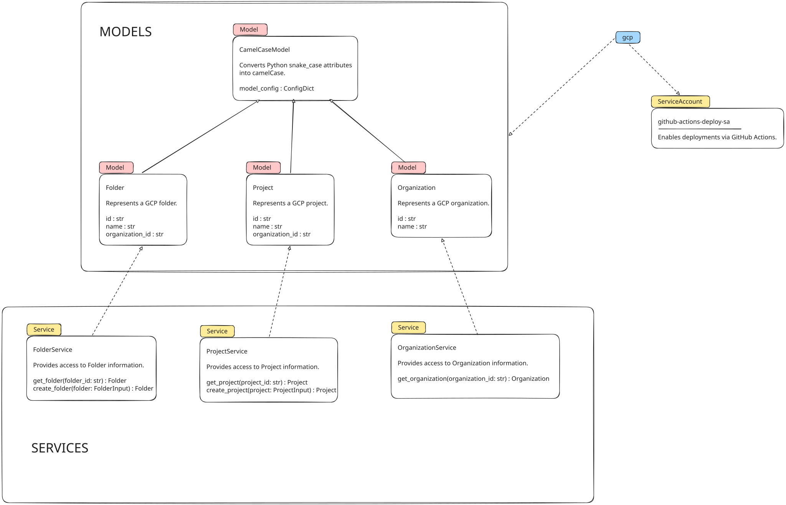

# gcp

Tools to bootstrap development on _Google Cloud Platform (GCP)_.

# Environments

The project is deployed across multiple environments, each of which has its own Terraform configuration.

| Environment | Description |
| ----------- | ----------------------------------------------------------------- |
| development | Development environment for testing and experimentation.          |
| staging     | Staging environment for pre-production testing.                   |
| production  | Production environment for live deployment.                       |

*Terraform* configurations are located in the `terraform/environments` directory.

# Architecture

The project _architecture_ is summarized below.



# Project Structure

The project _structure_ is summarized below.

```sh
gcp
├── .github
│   └── workflows
├── diagrams
├── docs
├── cli
│   └── domain
│       ├── models
│       └── services
├── scripts
│   ├── ci
│   ├── gcp
│   └── sa
├── terraform
│   └── environments
│       ├── development
│       ├── production
│       └── staging
└── tests
    ├── models
    └── services
```

| Environment | Description                                                       |
| ----------- | ----------------------------------------------------------------- |
| _.github_   | Contains GitHub **workflows** for CI/CD.                          |
| _diagrams_  | Contains project architecture **diagrams**.                       |
| _docs_      | Contains project **documentation**.                               |
| _cli_       | Contains project **source code** for GCP tooling.                 |
| _scripts_   | Contains **utility scripts** for managing the project.            |
| _terraform_ | Contains **Terraform configurations** for different environments. |
| _tests_     | Contains **unit and integration tests** for the project.          |


# Workload Identity Federation

The project uses *[Direct Workload Identity Federation](https://github.com/google-github-actions/auth?tab=readme-ov-file#preferred-direct-workload-identity-federation)* to manage identities and access across different environments.